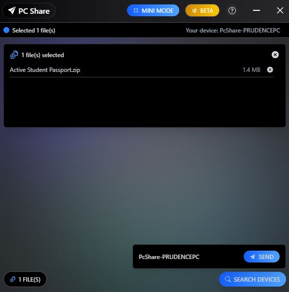

# ⚡ PC Share – Fast, Always-On Desktop File Sharing

**PC Share** is a simple yet powerful desktop file-sharing app that enables ultra-fast, always-on transfers between devices. Designed for speed, minimalism, and reliability, it makes sharing files between desktops as easy as dragging and dropping — no setup, no bloat.

---

## ✨ Features

- 🚀 **Instant Sending:** Drag & drop to share files with other desktops on your network
- 📡 **Always-On:** Runs quietly in the background and is always ready
- 🖥️ **Cross-Platform:** Works on Windows, macOS, and Linux
- 🎯 **Minimal UI:** Clean interface for focused sharing without distractions
- 🔐 **Secure:** Peer-to-peer transfers over LAN with optional encryption
- 🌐 **Auto-Discovery:** Detects nearby devices automatically (Bonjour/mDNS-based)

---

## 📦 Installation

### Windows

Download the latest installer from [Releases](https://github.com/your-username/blinknet/releases) and run it.

